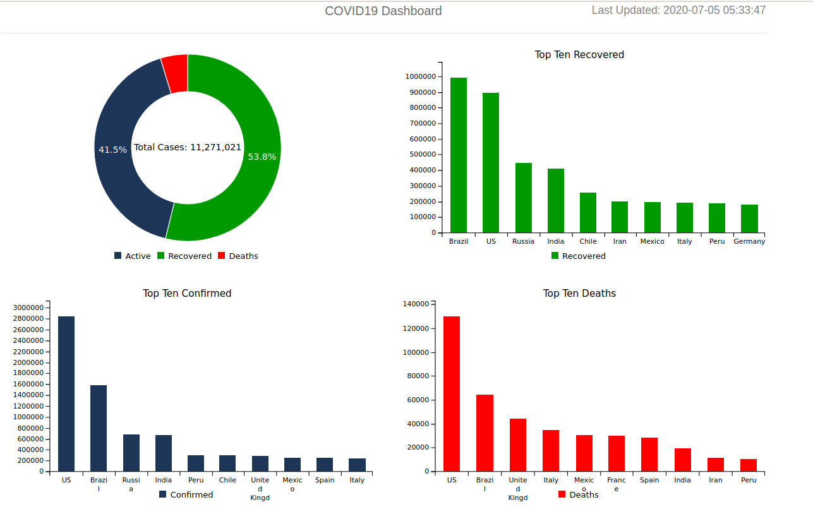

Click this link to see the live project http://covid19-dashboard-abin.herokuapp.com

Covid19 analytics Dashboard created using the data from the API https://services1.arcgis.com/0MSEUqKaxRlEPj5g/arcgis/rest/services/Coronavirus_2019_nCoV_Cases/FeatureServer/1/query?where=1%3D1&outFields=*&outSR=4326&f=json

Used Python, Flask, Pandas and C3js to create the project.

